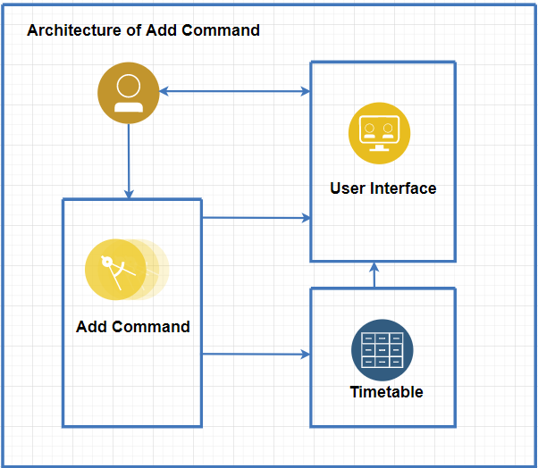
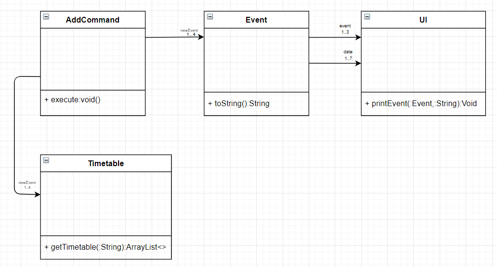
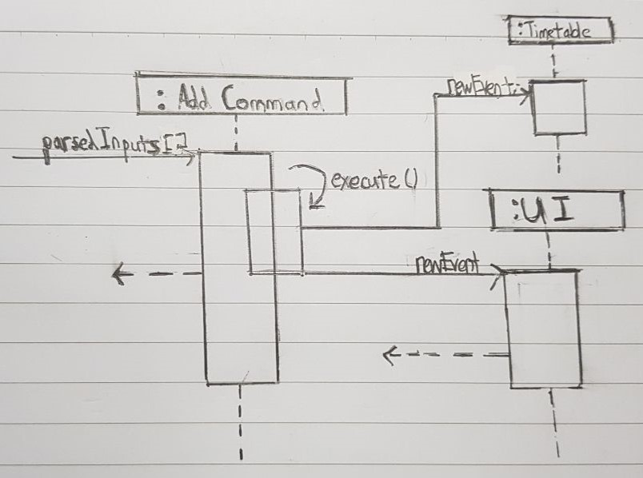

# Developer Guide

## Design & implementation

### System Architecture of the Add Function 

The Architecture Diagram given above explains the high-level design of the add command. 

Below we will discuss a quick overview of each component.

* UI: The User Interface of the app 
* Add Command: The main logic command of the add function 
* Timetable: The arraylist where events that are added are stored accordingly 

### Design of the Add Function 

UML Class Diagram of the Add function:
 

1) The Add function gets the inputs from the User and places it to the event class so that 
it can parser to string. 
2)  It will then pass the event data onto UI class to display and inform user of the event added 
to the timetable. 
3) Next,the add function will pass all the parameters (event name,day,time
and location) to the timetable class into its arraylist divided by the day of the week 

### Sequence Design of Add Function 
 

### Improvements to be made to Version 2.0 
* To ensure that the users do not enter duplicate event that has the same timing or in between the time 
that is entered. 
* A verification check is added to the add command of the version 2.0 of WhereGotTime.

E.g.
* add /CS2113 Lec /Mon /1200-1400 /LT21 
* add /CS2113 Lec /Mon /1300-1400 /LT22 
* add /CS2040C Tut /Mon /1300-1500 /LT32 

The above would result in the first line being add,
while the other two will result in the app giving an error message
prompting the user to re-enter again. 

Edit Function 

Delete Function 

Clear Function 

Display Function 

Compare Function 

## Product scope
### Target user profile

Our Application, WhereGotTime is developed for University students.

### Value proposition
It was developed to solve the inconvenience students face when accessing timetables and lecture venues and
to keep track of their timetable.
It is also developed to assist in finding common available time slots for students to study with their peers.

## User Stories

|Version| As a ... | I want to ... | So that I can ...|
|--------|----------|---------------|------------------|
|v1.0|new user|login to my own timetable|be sure that it is my own timetable that is shown there|
|v1.0|new user|add events into my timetable for the day|refer to the timetable to remind me of the event|
|v1.0|new user|edit events that I have entered into my timetable for the day|easily change the details as I need it|
|v1.0|new user|delete events in my timetable for the day|remove an event in the timetable that I do not wish to keep|
|v1.0|new user|clear my timetable for the day|so that I can remove all the entries I have entered wrongly|
|v1.0|new user|compare my timetable with my friends|schedule a common time for revision together|
|v2.0|user|have my password encrypted|only I can access my own timetables|
|v2.0|user|be assured that my inputs are correctly added|my input are correctly convey into the timetable|
|v2.0|user|access my saved timetables|I do not have to manually enter the timetables again|

## Non-Functional Requirements

{Give non-functional requirements}

## Glossary

* *glossary item* - Definition

## Instructions for manual testing

login Alex /123123 
add /CS2113 Lec /mon /1200-1300 /LT21 
add /CS3243 Lec /mon /1400-1500 /LT22 
add /CS2040C Tut /mon /0800-1000 /COM1-2 
add /CG2028 Tut /Thu /0900-1100 /E4-4-1 
add /CG2023 Lec /Fri /1700-1800 /E7-3-10 
list /all 
list /mon 
edit /mon /3 /1300-1400 
edit /fri /1 /0900-1100 
list /all 
list /mon 
login Tammy /321321 
add /CS2113 Lec /mon /1200-1300 /LT21 
add /CS2040C Tut /mon /0800-1000 /COM1-2 
add /CG2028 Tut /Thu /0900-1100 /E4-4-1 
compare /Alex /mon 
list /mon 
edit /mon /2 /1000-1200 
compare /Alex /mon 
login Alex /123123 
delete /mon /2 
clear /fri 
bye 
