# Developer Guide

## Table of content
**1. Setting Up**\
**2. Design**\
**3. Implementation**

## 1. Setting Up

**Prerequisites:**
* JDK 11
* IntelliJ IDE

Refer to the guide [_Setting Up_](SettingUp.md).

## 2. Design

### 2.1 Architecture
The **Architecture Diagram** below shows a high-level design of WhereGotTime. The design is based 
on multi-tier architecture where the processing, UI, logic and data management are separated. The upper
tiers make use of services provided by lower tiers.

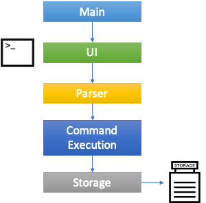

Here is a quick overview of the main components of WhereGotTime:
1. `WhereGotTime` - initializes the components in the app
1. `UI` - the user interface of the app
1. `Parser` - analyzes and interprets user input
1. `Command` - executes the action required by user
1. `Storage` - reads and writes data to file 
1. `Common` - collection of classes used by multiple components
   * `Users` - the users who have logged into WhereGotTime
   * `Timetable` - the timetable of each of the users
   * `Event` - an object representing a lesson in the timetable

**How architecture components interact**

The following Sequence Diagram displays how components interact when the user inputs `clear /fri`

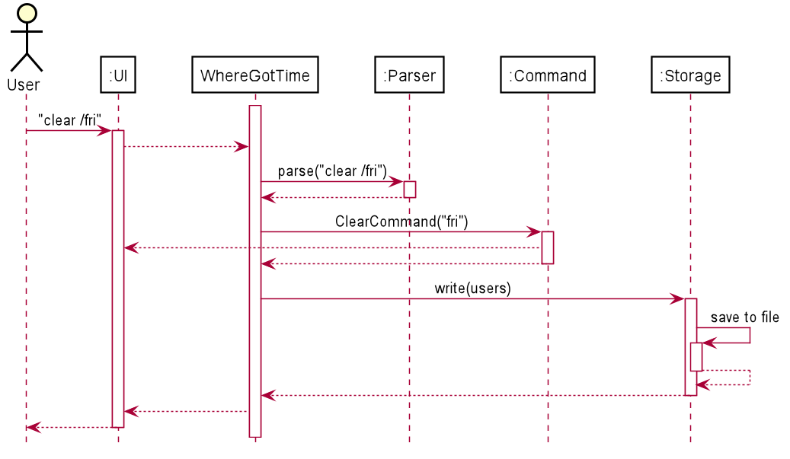

## 3. Design & Implementation
This section describes how features/functions are implemented.

### Parser Component

### Add Function

#### System Architecture of the Add Function 

The Architecture Diagram given above explains the high-level design of the add command. 

Below we will discuss a quick overview of each component.

* UI: The User Interface of the app 
* Add Command: The main logic command of the add function 
* Timetable: The arraylist where events that are added are stored accordingly 

#### Design of the Add Function 

UML Class Diagram of the Add function:
 

1) The Add function gets the inputs from the User and places it to the event class so that 
it can parser to string. 
2)  It will then pass the event data onto UI class to display and inform user of the event added 
to the timetable. 
3) Next,the add function will pass all the parameters (event name,day,time
and location) to the timetable class into its arraylist divided by the day of the week 

#### Sequence Design of Add Function 
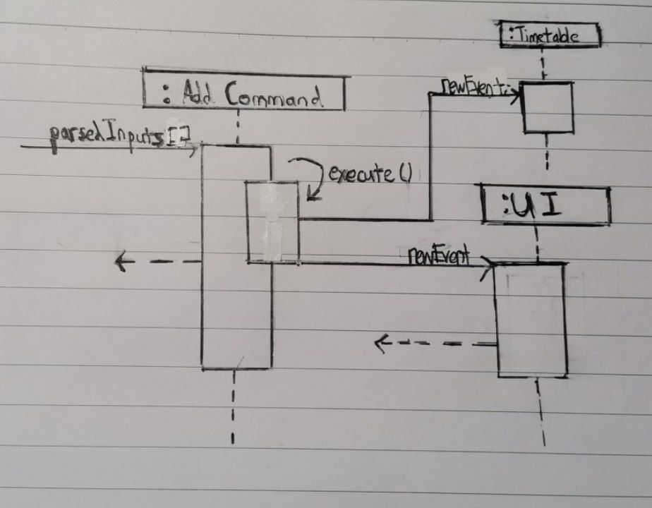 

#### Improvements made to Version 2.0 
* To ensure that the users do not enter duplicate event that has the same timing or in between the time 
that is entered. 
* A verification check is added to the add command of the version 2.0 of WhereGotTime.

E.g.
* add /CS2113 Lec /Mon /1200-1400 /LT21 
* add /CS2113 Lec /Mon /1300-1400 /LT22 
* add /CS2040C Tut /Mon /1100-1300 /LT32 

The above would result in the first line being add,
while the other two will result in the app giving an error message
prompting the user to re-enter again. 

### Edit Function 

#### Class Diagram  

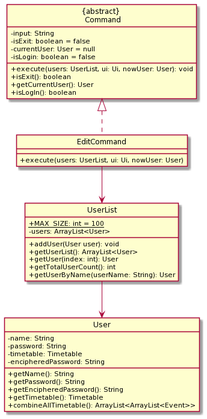 

### Delete Function

#### System Architecture of the Delete Function 

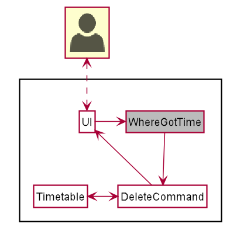

The Architecture Diagram given above explains the high-level design of the delete command. 
* UI: The User Interface of the app 
* DeleteCommand: The main logic command of the delete function 
* Timetable: The arraylist where events that are added are stored accordingly 
* WhereGotTime: The main logic component of the app 

#### Design of the Delete Function 

1. `DeleteCommand` gets the input from the User and gets the relevant timetable from `Timetable`
1. `DeleteCommand` then proceeds to delete the event in the timetable based on the index in the user input
1. `DeleteCommand` passes the day, deleted event and size of timetable to the `UI`
1. `UI` updates the user of the successful deletion of the event

#### Sequence Design of Delete Function 
 

### Clear Function

#### System Architecture of the Clear Function 

The Architecture Diagram given above explains the high-level design of the clear command. 
* UI: The User Interface of the app 
* ClearCommand: The main logic command of the clear function 
* Timetable: The arraylist where events that are added are stored accordingly 
* WhereGotTime: The main logic component of the app 

#### Design of the Clear Function 

1. `ClearCommand` gets the input from the User and gets the relevant timetable from `Timetable`
1. `ClearCommand` then proceeds to clear all events from the timetable
1. `ClearCommand` passes the day and cleared lesson to the `UI`
1. `UI` updates the user of the successful clearing of events

#### Sequence Design of Clear Function 
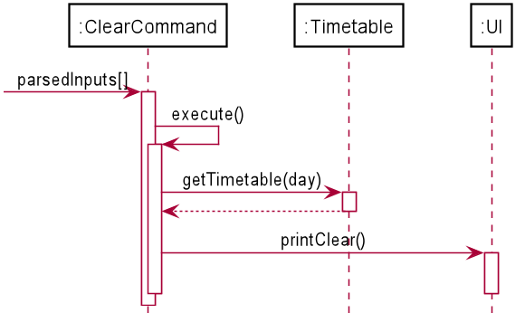 

### List Function

#### System Architecture of the List Function 

The Architecture Diagram given above explains the high-level design of the list command. 
* UI: The User Interface of the app 
* ListCommand: The main logic command of the list function 
* Timetable: The arraylist where events that are added are stored accordingly 
* WhereGotTime: The main logic component of the app 

#### Design of the List Function 

1. `ListCommand` gets the input from the User and gets the relevant user's timetable(s) from `Timetable`
1. `ListCommand` then passes the user's timetable(s) to the `UI`
1. `UI` prints all the classes in the timetable

#### Sequence Design of List Function 
 

### Find Function

#### System Architecture of the Find Function 

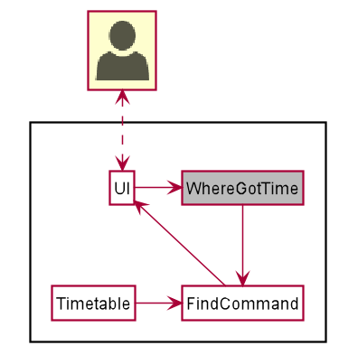

The Architecture Diagram given above explains the high-level design of the find command. 
* UI: The User Interface of the app 
* FindCommand: The main logic command of the find function 
* Timetable: The arraylist where events that are added are stored accordingly 
* WhereGotTime: The main logic component of the app 

#### Design of the Find Function 

1. `FindCommand` gets the input from the User and gets the timetable from `Timetable`
1. `FindCommand` then searches through the timetable to find event that match the keyword entered by User
1. `FindCommand` passes the matching events to `UI`
1. `UI` prints the matching events

#### Sequence Design of Find Function 
 

### Compare Function 
#### System Architecture of the Compare Function 
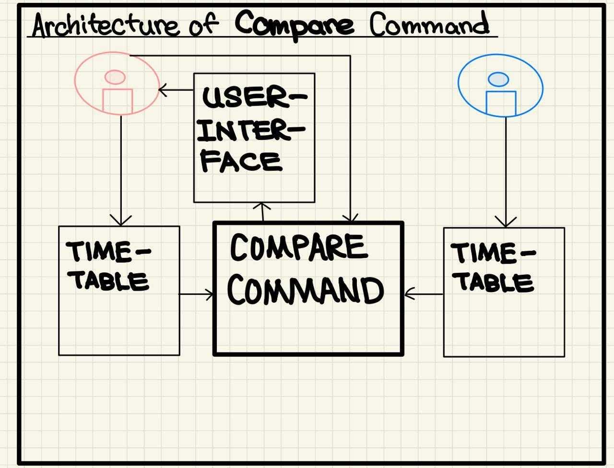  
The System Architecture given above explains the high-level design of the <b>COMPARE</b> command. 

Listed below are some features we will be highlighting: 

* Ui: The User Interface of the app 
* CompareCommand: The main logic command of the <b>COMPARE</b> function 
* Timetable: The arraylist where events that are added are stored accordingly 
* User: User(s) of the program 
* UserList: An arraylist of User 

#### Design of the Compare Function 
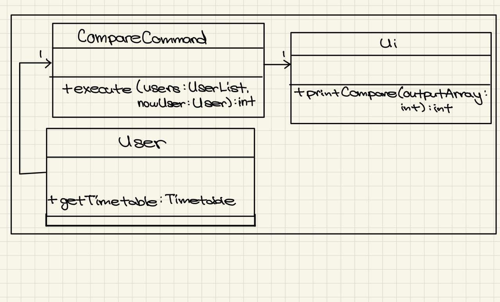 

1) The <b>COMPARE</b> function gets the inputs from the User and retrieves the User's / Target User's 
timetables based on a specific day. It will then compare the timetables and return an arraylist
of common timeslots. 
2)  It will then pass the arraylist onto Ui class to display the range of common  
timeslots the User and Target User have on a specific day of the week. 

#### Sequence Design of Compare Function 
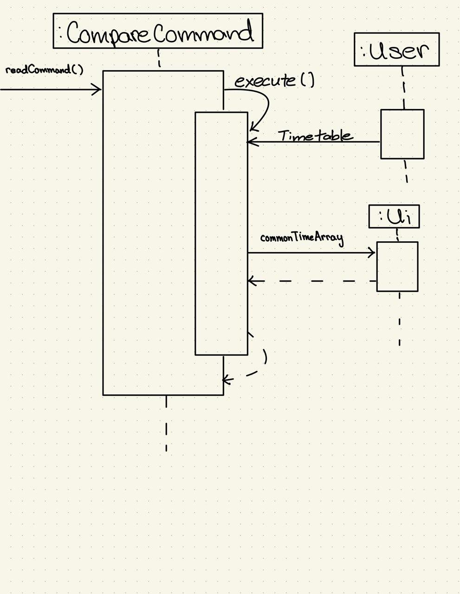  

#### Improvements made to Version 2.0 
* Display a range of timings instead of individual hours 
* Remove edge cases 

E.g. 
* compare /Alex /Mon 
* compare /Tammy /Mon 

These cases above would no longer output "0000HR, 0100HR" etc but
instead "0000HR - 1000HR"

### Login Function
#### System Architecture of the Login Function 

* UI: The User Interface of the app 
* LogInCommand: The main logic command of the Login function 
* Parser: The main logic that takes input data and builds the command.
* User: The Class where username, password, etc are stored
* UserList: The Class that creates an ArrayList where the User objects will be stored

#### Class Diagram
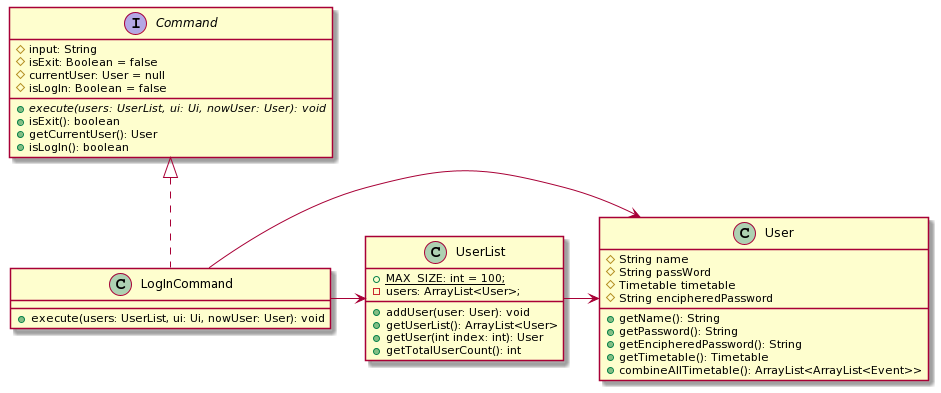
1.) The LogInCommand checks the UserList to check if the inputted user already exists.
 
2.) In the case that the User is a first time user, the LogInCommand will create a new User object then add it into 
the UserList. 

#### Sequence Diagram

1.) When the user inputs a Login Command, a LogInCommand Object is created with the input member Username and Password.
 
2.) The Login Command is then executed by sending the users UserList, ui Ui and the User nowUser to the method where 
it search the users to check if the input Username already exists with the correct password.
 
3.) If the User already exists, it will return the User back to the method as currentUser. Otherwise, it will create a
User with the input Username and Password.
 

#### Improvements made to Version 2.0 
* In order to protect the User's privacy, the User's Passwords have been encrypted on the save file. 
* A Cryptography Class with encipherPassword and decipherPassword has been implemented as part of the version 2.0 of 
WhereGotTime.
* Added Storage capability to allow saving and loading of user's timetable
* revamped edit command so that it's more intuitive and user-friendly

## Product scope
### Target user profile

Our Application, WhereGotTime is developed for University students.

### Value proposition
It was developed to solve the inconvenience students face when accessing timetables and lecture venues and
to keep track of their timetable.
It is also developed to assist in finding common available time slots for students to study with their peers.

## User Stories

|Version| As a ... | I want to ... | So that I can ...|
|--------|----------|---------------|------------------|
|v1.0|new user|login to my own timetable|be sure that it is my own timetable that is shown there|
|v1.0|new user|add events into my timetable for the day|refer to the timetable to remind me of the event|
|v1.0|new user|edit events that I have entered into my timetable for the day|easily change the details as I need it|
|v1.0|new user|delete events in my timetable for the day|remove an event in the timetable that I do not wish to keep|
|v1.0|new user|clear my timetable for the day|so that I can remove all the entries I have entered wrongly|
|v1.0|new user|compare my timetable with my friends|schedule a common time for revision together|
|v2.0|user|have my password encrypted|only I can access my own timetables|
|v2.0|user|be assured that my inputs are correctly added|my input are correctly convey into the timetable|
|v2.0|user|access my saved timetables|I do not have to manually enter the timetables again|

## Instructions for manual testing

login /Alex /123123 
add /CS2113 Lec /mon /1200-1300 /LT21 
add /CS3243 Lec /mon /1400-1500 /LT22 
add /CS2040C Tut /mon /0800-1000 /COM1-2 
add /CG2028 Tut /Thu /0900-1100 /E4-4-1 
add /CG2023 Lec /Fri /1700-1800 /E7-3-10 
list /all 
list /mon 
edit /mon 
/3 /1300-1400 
edit /fri 
/1 /0900-1100 
list /all 
list /mon 
login /Tammy /321321 
add /CS2113 Lec /mon /1200-1300 /LT21 
add /CS2040C Tut /mon /0800-1000 /COM1-2 
add /CG2028 Tut /Thu /0900-1100 /E4-4-1 
compare /Alex /mon 
list /mon 
edit /mon 
/2 /1000-1200 
compare /Alex /mon 
login /Alex /123123 
delete /mon /2 
clear /fri 
bye 
